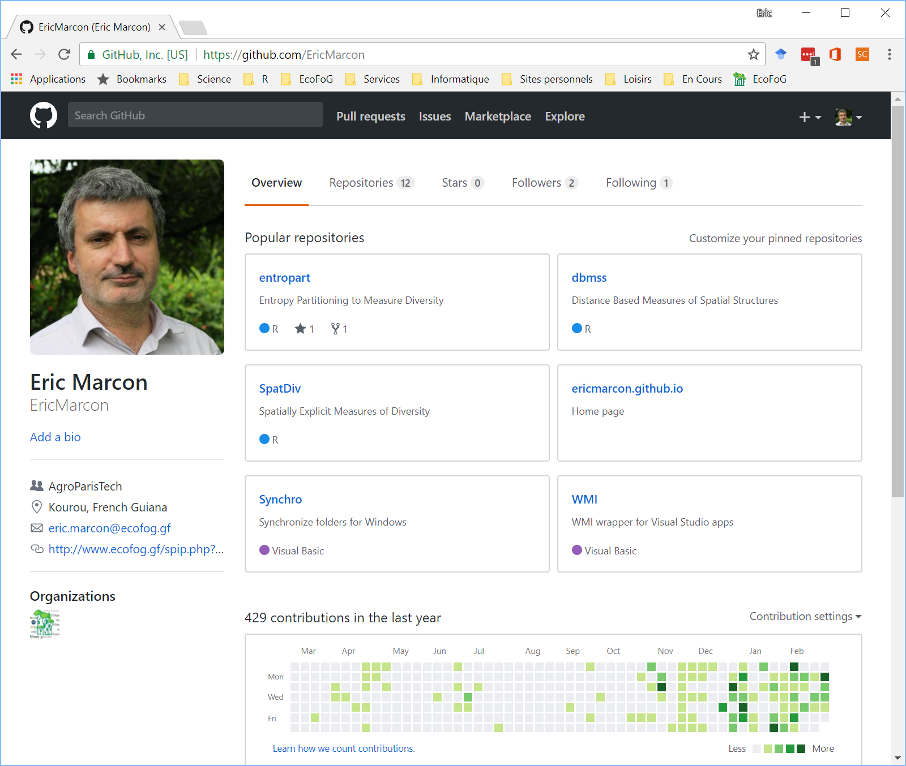
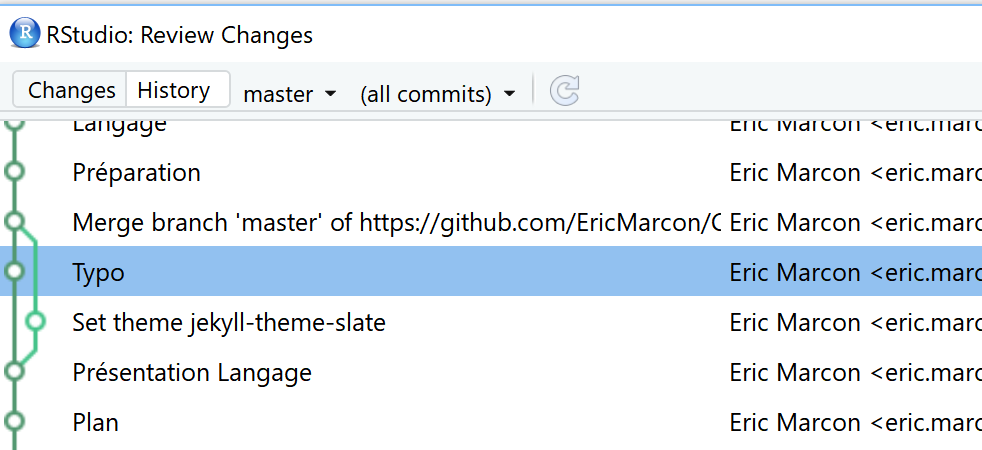

```{r setup, include=FALSE}
### knitr and R options (packages, ...)
# echo=FALSE not to display R chunk in slides. Set to TRUE if necessary.
knitr::opts_chunk$set(echo = FALSE)
# tidy R chunks.
knitr::opts_chunk$set(tidy=TRUE, tidy.opts=list(blank=FALSE, width.cutoff=50))
# R console width
options(width=50)
# Installation des packages si nécessaire et chargement
Library <- function(Packages) {
  InstallAndLoad <- function(Package) {
    if (!Package %in% installed.packages()[, 1]) {install.packages(Package, repos="https://cran.rstudio.com/")}
    require(Package, character.only = TRUE)
  }
  invisible(sapply(Packages, InstallAndLoad))
}
# Ajouter les packages nécessaires ici
Library(c("kableExtra", "formatR", "tidyverse"))
# Set ggplotting to bw plot default, but with transparent background elements.  
theme_set(theme_bw(base_size=12))
theme_update(panel.background = element_rect(fill = "transparent", colour = NA),
             plot.background = element_rect(fill = "transparent", colour = NA))
knitr::opts_chunk$set(dev.args=list(bg="transparent"))
# Tibbles: 5 lines, fit to slide width
options(tibble.print_min = 5, tibble.width = 50)
```

# Principes

## git

git est un gestionaire de sources :

- Suivi des modifications : bien plus qu'une sauvegarde !
- Possibilité de revenir en arrière ;
- Plusieurs versions concurrentes : branches.

## GitHub

GitHub est une plateforme pour la collaboration basée sur Git.

- Possibilité de développer à plusieurs : fin des pièces jointes !
- Présentation des résultats : pages GitHub ;
- Intégration continue: Travis.

# Mise en place

RStudio doit détecter Git

```{r, echo=FALSE, out.width='60%'}
knitr::include_graphics("images/Roptions.PNG")
```

Sinon, l'installer.


## Mise en place

Ouvrir un compte sur GitHub

```{r, echo=FALSE, out.width='60%'}

```


## Créer un projet

A partir de rien :

- Dans GitHub : 

    - _New Repository_
  
    - Choisir le nom (pas de caractères spéciaux)
  
    - Ajouter un _.gitgnore_ approprié.

- Copier l'URL à partir de _Clone or Download_

- Dans RStudio : nouveau projet à partir de Git, coller l'URL.


## Créer un projet

A partir d'un projet RStudio existant :

- Passer le projet sous contrôle de version : 

    - _Tools /Version Control /Project Setup..._
    
    - Sélectionner _Git_.

- Créer un dépôt sur GitHub, récupérer son URL : https://github.com/MonCompte/MonDepot.git

- Dans le Terminal de RStudio, exécuter :

```
git remote add origin https://github.com/MonCompte/MonDepot.git
git push -u origin master
```

## Opérations élémentaires : filtrage

Les fichiers modifiés sont dans la fenêtre Git de RStudio.

Utiliser .gitignore pour masquer les fichiers non suivis.

- Créer un fichier R avec une ligne de code et l'enregistrer.


## Opérations élémentaires : commit

Après chaque séance de travail, livrer le résultat (_Commit_)

Sélectionner les fichiers à livrer.

Saisir un message clair : résumé sur la première ligne.


## Opérations élémentaires : synchroniser

Pousser (_Push_) ses modifications vers GitHub pour les rendre publiques.

Tirer (_Pull_) pour résupérer les modifications sur GitHub.


## Opérations élémentaires : collaborer

Déclarer un collaborateur.

Travailler à deux ou plus sur le même fichier.

Contenu d'une séance de travail :

- Tirer ;

- Modifier ;

- Livrer ;

- Pousser.


## Conflits

L'information élémentaire est la ligne.

Modifications contradictoires =  conflit.

Minimiser les conflits : dans un texte, une phrase = une ligne.

En cas de conflit, trancher.


## Suivi du projet

Icône en forme d'horloge dans la fenêtre Git

```{r, echo=FALSE, out.width='80%'}

```


# Pratique

## Modifier le projet Cours-R-Introduction

Ajouter un fichier README.md

Prendre en compte, valider et pousser.

## Générer un conflit

Editer la même ligne de README.md :

- en ligne sur GitHub ;
- localement.

Tirer, constater le conflit, le résoudre.

## Collaborer avec son voisin

Le voisin de gauche invite celui de droite sur GitHub.

Les deux modifient le projet.

- Bien penser à tirer avant de modifier.
- Pousser rapidement pour limiter les conflits.


# Branches

## Intérêt

Modifier le projet sans perturber son état stable.

Application : 

- développer une nouvelle fonctionnalité ;
- la tester, corriger les bugs ;
- la rendre visible quand elle est terminée.


## Créer une branche

Cliquer sur New Branch

Travailler dans la nouvelle branche (pull, commit, push).


## Fusionner

Se placer dans la branche master.

Exécuter:
```
git merge branche_a_fusionner
```
