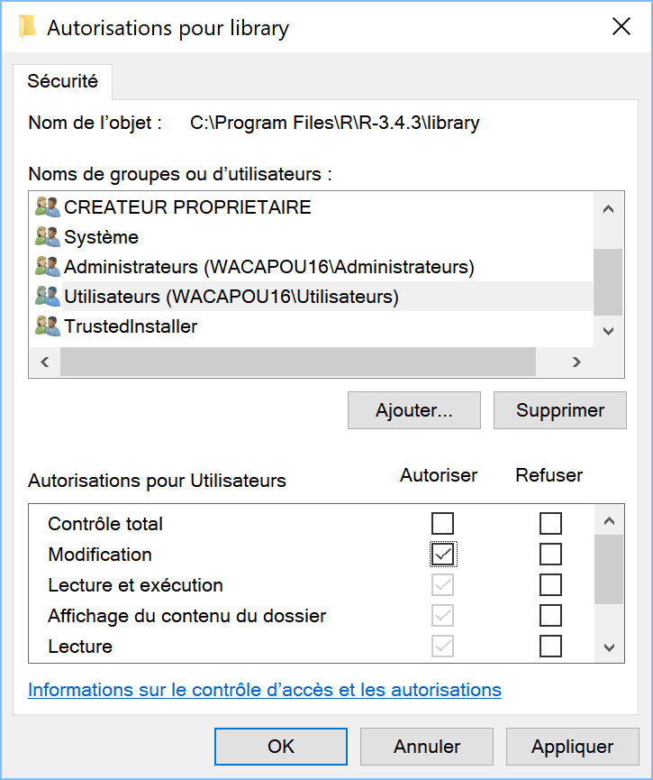

```{r DoNotModify, include=FALSE}
### Utilities. Do not modify.
# Installation of packages if necessary
InstallPackages <- function(Packages) {
  InstallPackage <- function(Package) {
    if (!Package %in% installed.packages()[, 1]) {
      install.packages(Package, repos="https://cran.rstudio.com/")
    }
  }
  invisible(sapply(Packages, InstallPackage))
}

# Basic packages
InstallPackages(c("bookdown", "formatR", "kableExtra", "ragg"))

# kableExtra must be loaded 
if (knitr::opts_knit$get("rmarkdown.pandoc.to") == "docx") {
  # Word output (https://stackoverflow.com/questions/35144130/in-knitr-how-can-i-test-for-if-the-output-will-be-pdf-or-word)
  # Do not use autoformat (https://github.com/haozhu233/kableExtra/issues/308)
  options(kableExtra.auto_format = FALSE)
}
library("kableExtra")

# Chunk font size hook: allows size='small' or any valid Latex font size in chunk options
def.chunk.hook  <- knitr::knit_hooks$get("chunk")
knitr::knit_hooks$set(chunk = function(x, options) {
  x <- def.chunk.hook(x, options)
  ifelse(options$size != "normalsize", paste0("\n \\", options$size,"\n\n", x, "\n\n \\normalsize"), x)
})
```

```{r Options, include=FALSE}
### Customized options for this document
# Add necessary packages here
Packages <- c("tidyverse")
# Install them
InstallPackages(Packages)

# knitr options
knitr::opts_chunk$set(
  cache=FALSE, # Cache chunk results
  echo = TRUE, # Show/Hide R chunks
  warning=FALSE, # Show/Hide warnings
  message=FALSE,  # Show/Hide messages
  # Figure alignment and size
  fig.align='center', out.width='80%',
  # Graphic devices (ragg_png is better than standard png)
  dev = c("ragg_png", "pdf"),
  # Code chunk format
  tidy=TRUE, tidy.opts=list(blank=FALSE, width.cutoff=50),
  size="scriptsize", knitr.graphics.auto_pdf = TRUE
  )
options(width=50)

# ggplot style
library("tidyverse")
theme_set(theme_bw())
theme_update(panel.background=element_rect(fill="transparent", colour=NA),
             plot.background=element_rect(fill="transparent", colour=NA))
knitr::opts_chunk$set(dev.args=list(bg="transparent"))

# Tibbles: 5 lines, fit to slide width
options(tibble.print_min = 5, tibble.width = 50)

# Random seed
set.seed(973)
```


# R

## Espace de travail hors git

Dossier personnel, appelé `~` par RStudio :

```{r R_USER, echo=TRUE}
Sys.getenv("R_USER")
```

-   Mes Documents sous Windows ;
-   Home sous Mac ou Linux.

Travailler dans un sous-dossier, par exemple : *Formation*.

Pas d'espace ni caractère spécial dans les noms de dossier.

S'assurer que le dossier est sauvegardé.


## Espace de travail sous git

Créer un dossier autorisé en écriture mais non sauvegardé.

Sous Windows:

    md %LOCALAPPDATA%\ProjetsR

Travailler dans des sous-dossiers, par exemple : *Formation*.

Pas d'espace ni caractère spécial dans les noms de dossier.


## Librairies système et utilisateur

Stockage des packages dans la librairie système si R peut y écrire.

```{r R-library, echo=FALSE, out.width='40%'}

```

Utile si `~` est sauvegardé.


# RStudio

## Environnement de travail

Incontournable.

Intègre la majorité des outils utiles.

Mettre à jour à chaque changement de version R.

[RStudio Server](https://rstudio.cloud/projects/) est strictement équivalent.


## Projets

Organiser le travail en projets :

-   un dossier dans \~ (ou un sous-dossier de \~) ou `ProjetsR` ;
-   un fichier .Rproj dans le dossier.

Création par le menu *New Project*.

Pas de caractères spéciaux, pas d'espace dans le nom.


## Environnement de travail

La fenêtre *Environnement* liste les variables et fonctions.

-   Sauvegarde dans un fichier RData / Ouverture d'un RData ;
-   Sauvegarde automatique en fin de session.

La fenêtre *History* liste l'historique des commandes :

-   Sauvegarde, idem ;
-   Envoi à la console ou au fichier source.


## Packages

Utiliser un fichier *Packages.R*.

```{r Packages, echo=TRUE, eval=FALSE}
# Install necessary packages only
InstallPackages <- function(Packages) {
  sapply(Packages, function(Package) 
    if (!Package %in% installed.packages()[, 1]) install.packages(Package))
}
# Markdown
InstallPackages(c("base64enc", "knitr", "rmarkdown", "bookdown"))
# Other packages
InstallPackages(c("RODBC", "devtools"))
# EcoFoG
devtools::install_github("EcoFoG/EcoFoG")
```

Mis en pratique à la fin de la séquence.


# Logiciels

## Architecture

R utilise des packages et appelle des programmes externes pour la création de documents et de packages.

Instructions pour les installations dans [Travailler avec R, chapitre 1](https://ericmarcon.github.io/travailleR/chap-logiciels.html).


## Packages R

-   **devtools** : utilitaires pour le développement ;
-   **knitr**, **rmarkdown**, **bookdown**: rédaction avec RMarkdown.

Utiliser *Packages.R* pour une réinstallation rapide.


## LaTeX complet

Production de fichiers PDF :

-   Présentations Beamer ;
-   Articles et ouvrages PDF.

Installer *MikTex* sous Windows, *MacTex* sous Mac, *TexLive* sous Linux.

Compléter par *TeXstudio* pour débugger les compilations difficiles et *Jabref* pour gérer les fichiers bib.


## LaTeX pour R

Installer le package **tinytex**.

Exécuter
```{r, eval=FALSE}
tinytex::install_tinytex()
```

Installe une distribution très compacte de LaTeX.


## Bibliographie

Utiliser un gestionnaire bibliographique capable de produire un fichier *bib* : *Mendeley* ou *Zotero*.

*Jabref* permet de gérer totalement sa bibliographie au format *BibTeX*.


## Développement

Sous Windows, compléter R par Rtools : outils pour R.

Installations souhaitables :

-   qpdf : vérification de la compression des fichiers PDF ;
-   Ghostscript : traitement des fichiers PDF.

A compléter en temps utiles.


## Git

*Git* est un outil de gestion de sources.

Le moteur de Git doit être installé.

RStudio intègre une interface pour Git.

Ouvrir un compte sur [GitHub](https://github.com/) pour collaborer.


# Pratique

## Installations

Installer R et RStudio.

Installer git. 

Ouvrir un compte sur GitHub.


## Adhésion à la classe GitHub

Valider l'invitation envoyée pour la classe Cours-R.

Lier son nom d'invité et son compte GitHub.

Accepter l'assignation Cours-R-Introduction.


## Cours-R-Introduction

Contient des ressources.

Récupérer le fichier `Packages.R` et le placer dans `~`
