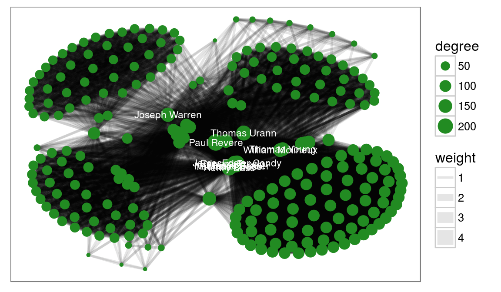

```{r DoNotModify, include=FALSE}
### Utilities. Do not modify.
# Installation of packages if necessary
InstallPackages <- function(Packages) {
  InstallPackage <- function(Package) {
    if (!Package %in% installed.packages()[, 1]) {
      install.packages(Package, repos="https://cran.rstudio.com/")
    }
  }
  invisible(sapply(Packages, InstallPackage))
}

# Basic packages
InstallPackages(c("bookdown", "formatR", "kableExtra", "ragg"))

# kableExtra must be loaded 
if (knitr::opts_knit$get("rmarkdown.pandoc.to") == "docx") {
  # Word output (https://stackoverflow.com/questions/35144130/in-knitr-how-can-i-test-for-if-the-output-will-be-pdf-or-word)
  # Do not use autoformat (https://github.com/haozhu233/kableExtra/issues/308)
  options(kableExtra.auto_format = FALSE)
}
library("kableExtra")

# Chunk font size hook: allows size='small' or any valid Latex font size in chunk options
def.chunk.hook  <- knitr::knit_hooks$get("chunk")
knitr::knit_hooks$set(chunk = function(x, options) {
  x <- def.chunk.hook(x, options)
  ifelse(options$size != "normalsize", paste0("\n \\", options$size,"\n\n", x, "\n\n \\normalsize"), x)
})
```

```{r Options, include=FALSE}
### Customized options for this document
# Add necessary packages here
Packages <- c("tidyverse")
# Install them
InstallPackages(Packages)

# knitr options
knitr::opts_chunk$set(
  cache=FALSE, # Cache chunk results
  echo = TRUE, # Show/Hide R chunks
  warning=FALSE, # Show/Hide warnings
  message=FALSE,  # Show/Hide messages
  # Figure alignment and size
  fig.align='center', out.width='80%',
  # Graphic devices (ragg_png is better than standard png)
  dev = c("ragg_png", "pdf"),
  # Code chunk format
  tidy=TRUE, tidy.opts=list(blank=FALSE, width.cutoff=50),
  size="scriptsize", knitr.graphics.auto_pdf = TRUE
  )
options(width=50)

# ggplot style
library("tidyverse")
theme_set(theme_bw())
theme_update(panel.background=element_rect(fill="transparent", colour=NA),
             plot.background=element_rect(fill="transparent", colour=NA))
knitr::opts_chunk$set(dev.args=list(bg="transparent"))

# Tibbles: 5 lines, fit to slide width
options(tibble.print_min = 5, tibble.width = 50)

# Random seed
set.seed(973)
```


# Manifeste

## Approche complète de l'analyse de données

Données bien rangées (_tidy_)

Enchaînement des opérations (`%>%` de _magrittr_, `+` de _ggplot2_)

Programmation fonctionnelle (pas orientée objet), optimisée pour les utilisateurs (lisibilité plutôt que performance)

```{r, eval=FALSE}
library("tidyverse")
vignette("manifesto", package="tidyverse")
```

Ensemble de packages, appelés par _tidyverse_


## Données rectangulaires

Modèle du data frame : une ligne par observation, une colonne par attribut.

Dataframe optimisé : `tibble`

Documentation : `vignette("tibble", package="tibble")`

```{r}
ggplot2::diamonds
```

## Pipe (tuyau)

Le package _magrittr_ introduit le pipe ` %>% ` (`Ctrl + Shift + m`)

```{r, echo=FALSE, out.width='50%'}
knitr::include_graphics(c("images/magritte.jpg", "images/magrittr.jpg"))
```

Modèle du pipeline de la programmation système repris par la bioinformatique

## Pipe (tuyau)

Exemple :
```{r}
1:10 %>% sum
```

Principe : les données résultant d'un calcul sont passées à la fonction suivante.

Enchaînement :
```{r}
1:10 %>% sqrt %>% sum
```

Code plus lisible que `sum(sqrt(1:10))`


## Autres opérateurs

Tuyau avec retour :
```{r, message=FALSE}
library("magrittr")
x <- c(4,9)
x %<>% sqrt
x
```
Embranchement :
```{r, out.width='5%'}
x %T>% plot %>% sum
```

## Autres opérateurs

Exposition :
```{r}
diamonds %$% mean(price)
# Équivalent à 
diamonds %>% pull(price) %>% mean
```

Le tuyau de base est accessible sans charger `magrittr`

Les autres sont moins utiles


## Méthode de travail


Bagarre (_Wrangling_) :

- Importation des données

- Rangement (_Tidy_)

- Transformation

Visualisation

Modélisation : non traitée ici. [A lire](http://r4ds.had.co.nz/model-intro.html).

Communication : RMarkdown et sorties graphiques. Lire :

- [Graphics for communication](http://r4ds.had.co.nz/graphics-for-communication.html)

- [Top 50 ggplot2 Visualizations](http://r-statistics.co/Top50-Ggplot2-Visualizations-MasterList-R-Code.html)


# Bagarre

## Package _readr_

Lecture de fichiers texte variés.

Importation dans un tibble.

[Référence](http://r4ds.had.co.nz/data-import.html#data-import)


## Fichier csv

Fonctions `read_csv()` et `read_csv2()`

Remplacent `read.csv()` et `read.csv2()` de base

Plus rapide que les fonctions originales.


## Rangement


```{r, echo=FALSE, out.width='90%'}
knitr::include_graphics("images/tidy-1.png")
```

Approche habituelle en écologie (analyse multivariée par exemple)

Si les données sont mal rangées ("pas tidy"), quelques manipulations de base.

[Référence](http://r4ds.had.co.nz/tidy-data.html)


## Exemple

Données : inventaire d'une parcelle de Paracou, 4 carrés distincts.

Lire les données :

```{r}
Paracou6 <- read_csv2("data/Paracou6.csv")
```

- Afficher Paracou6


## Rassemblement (_unite_)

Famille, genre et espèce des arbres sont dans 3 colonnes.

Créer une colonne avec le nom complet de l'espèce.

```{r, tidy=FALSE}
Paracou6 %<>%
  unite(col=spName, Family, Genus, Species, remove=FALSE)
```

- Afficher le résultat.

Le pipeline `%>%` (`Ctrl + Shift + m`) passe la donnée à la fonction suivante.
Le pipeline avec retour modifie la variable de départ.

La commande classique est :
```{r, eval=FALSE}
Paracou6 <- unite(data=Paracou6, col=spName, Family, Genus, Species, remove = FALSE)
```


## Séparation (_separate_)

Opération contraire

```{r, echo=FALSE, out.width='100%'}
knitr::include_graphics("images/tidy-17.png")
```


## Rassembler des colonnes (*pivot_longer*)

Opération inverse de la création d'un tableau croisé

```{r, echo=FALSE, out.width='100%'}
knitr::include_graphics("images/tidy-9.png")
```


## Séparer des colonnes (*pivot_wider*)

Crée une colonne par modalité d'une variable

```{r, echo=FALSE, out.width='90%'}
knitr::include_graphics("images/tidy-8.png")
```


## Valeurs manquantes

Les valeurs manquantes explicites (valeur `NA`) peuvent être conservées dans les manipulations ou simplement supprimées avec l'option `na.rm=TRUE`.

`complete(var1, var2)` ajoute des enregistrements pour toutes les combinaisons de var1 et var2 manquantes.


[Référence](http://r4ds.had.co.nz/tidy-data.html#missing-values-3)


## Transformation

Outils du package _dplyr_

Idée :

- enchaîner les opérations de transformation avec les `%>%` ;

- les écrire et les tester une à une.


## Filtrer les lignes (_filter_)

Filtrer par des conditions sur les différentes variables

```{r}
# Nombre de lignes
Paracou6 %>% count %>% pull
# Après filtrage
Paracou6 %>% filter(SubPlot==1) %>% count %>% pull
```
Remarquer : `pull()`qui extrait la valeur finale du tibble de taille 1x1 produit par `count()`.


## Sélectionner les colonnes (_select_)

Ne retenir que les colonnes intéressantes

```{r}
Paracou6 %>% select(SubPlot:Yfield, Family:Species, CircCorr) %>% ncol
```

Remarquer : `ncol()` est une fonction de _base_, pas du tidyverse.


## Ajouter des variables calculées (_mutate_)

Des colonnes sont ajoutées au tibble

```{r}
(Paracou6 %>% select(idTree, CircCorr) %>% mutate(Diametre=CircCorr/pi) -> Paracou6Taille)

```
Remarquer : les parenthèses pour `print()`


## Trier les lignes (_arrange_)

Afficher les plus gros arbres de la parcelle :

```{r}
Paracou6Taille %>% arrange(desc(CircCorr))
```

## Regrouper et résumer

Quel est le diamètre moyen des arbres par famille ?
```{r}
Paracou6 %>% group_by(Family) %>% summarise(Dmean=mean(CircCorr)/pi, NbTrees=n()) %>% arrange(desc(Dmean))
```

## Lier deux tables

`bind_cols()` et `bindrows()`.

```{r}
t1 <- tibble(col2 = c("A", "B"), col3 = 3:4)
tibble(col1 = 1:2) %>% bind_cols(t1)
```

Equivalent de `cbind()` et `rbind()`

## Joindre deux tables

`inner_join()`, `left_join()`, `right_join()` et `full_join()`

```{r}
tibble(col2 = c("B", "C"), col5 = 5:6) %>% inner_join(t1)
```

# Visualisation

## _ggplot2_

Package destiné à la création de graphiques.

Respecte la [grammaire graphique par couches](http://vita.had.co.nz/papers/layered-grammar.pdf) :

```
ggplot(data = <DATA>) + 
  <GEOM_FUNCTION>(
     mapping = aes(<MAPPINGS>),
     stat = <STAT>, 
     position = <POSITION>
  ) +
  <COORDINATE_FUNCTION> +
  <FACET_FUNCTION>
```

Les données sont obligatoirement un dataframe (un tibble est un dataframe).


## Esthétique

L'esthétique  désigne ce qui est représenté : 

- `x` et `y` (ou `fill` pour un histogramme...)

- transparence, couleur, type de courbe, taille, ... : voir l'aide de chaque `geom_`.

Fonction `aes()` à plusieurs niveaux :

- argument `mapping` de `ggplot()`, hérité par les couches (`geom_`)

- argument `mapping` de chaque couche.


## Géométrie

La géométrie est définie par une fonction `geom_xxx` et une esthétique (ce qui est représenté).

```{r, out.width='70%'}
ggplot(data=diamonds) + geom_point(mapping = aes(x=carat, y=price, color=cut)) + scale_colour_brewer(palette = "Set1")
```

## Statistiques

Chaque `geom_` va de pair avec une statistique de transformation des données : 

- "identity" pour `geom_point`

- "boxplot" pour `geom_boxplot`

- 20 statistiques disponibles...


## Statistiques

```{r}
ggplot(data=diamonds) + geom_boxplot(mapping = aes(x=cut, y=price))
```

## Statistiques

Différent de la transformation de variables (cf. _scale_) : le graphique utilise des données dérivées des données originales.

Chaque statistique a un `geom_` par défaut :

`stat_summary` est interchangeable avec `geom_pointrange`

## Statistiques

```{r}
ggplot(data = diamonds) + 
  stat_summary(
    mapping = aes(x = cut, y = depth),
    fun.min = min,
    fun.max = max,
    fun = median
  )
```

## Echelle

Transformation de variable.

```{r, out.width='70%'}
diamonds %>% filter(carat>.5) %>% 
  ggplot(aes(x=carat, y=price)) + geom_point() + scale_x_log10() + scale_y_log10() + geom_smooth(method="lm")
```


## Position

La position définit l'emplacement des objets sur le graphique.

- "identity" en général

- "stack" empile les catégories dans un histogramme

- "jitter" déplace aléatoirement les points dans un `geom_point` pour éviter les superpositions.


## Position

```{r, tidy=FALSE}
ggplot(data = diamonds) + 
  geom_bar(mapping = aes(x = cut, fill = color), position="stack") + 
  scale_fill_brewer(palette = "Set1")
```


## Coordonnées

Système de coordonnées :

- `coord_flip()` intervertit `x` et `y`

- `coord_polar()` : coordonnées polaires

- `coord_trans()` transforme l'affichage des coordonnées (mais pas les données comme `scale_`)

- etc.

Exemple : tracer la carte des wapas de la parcelle 6.

## Coordonnées

```{r}
(Paracou6 %>% filter(Genus=="Eperua") %>%
  ggplot() + geom_point(aes(x=Xfield, y=Yfield, size=CircCorr, color=Species)) + coord_fixed() -> P6Map)
```

## Facettes

Présente plusieurs aspects du même graphique.

Remarquer : la possibilité d'affiner un graphique.
```{r}
P6Map + facet_wrap(~ Species)
```


## Thèmes

Les thèmes définissent l'aspect des graphiques (hors traitement des données).

Dans ce document : pas de fond grisé dans les graphiques (`theme_bw`), police 12, modifié pour que le fond soit transparent.

```{r, eval=FALSE}
theme_set(theme_bw(base_size=12))
theme_update(panel.background = element_rect(fill = "transparent", colour = NA),
             plot.background = element_rect(fill = "transparent", colour = NA))
```

Ce sont des options globales, valides pour la session R en cours.


## Styles

Possibilité d'enregistrer des paramètres de forme au-delà du thème dans une liste.

Préparation d'un style pour l'impression en noir et blanc, sans cartouches de légende.

```{r, out.width='60%'}
MyStyle <- list(scale_colour_grey(), theme(legend.position="none"))
P6Map + MyStyle
```

## Gestion des couleurs

Les couleurs par défaut sont assez laides.

Utiliser `scale_color_xxx` et `scale_fill_xxx`

Le suffixe `_brewer` est pour utiliser des palettes de [ColorBrewer](http://colorbrewer2.org)

```{r, echo=FALSE, out.width='60%'}

```

## Gestion des couleurs

Le suffixe `_gradient` permet de produire un gradient de couleurs pour les valeurs continues.

Voir les autres fonctions dans l'aide du package.

- Méthode : se créer progressivement des styles (par ex. : couleur et noir et blanc), les enregistrer et les utiliser systématiquement.


## autoplot et qplot

`qplot()` mime la syntaxe de `plot()` avec _ggplot2_. Utiliser plutôt la syntaxe native.

`autoplot()` est un générique à étendre par des méthodes S3 pour faire des graphiques ggplot. Exemple:

```{r, out.width='50%', tidy=FALSE}
library("entropart")
Paracou618.MC$Ns %>% as.AbdVector %>% 
  autoplot(Distribution = "lnorm") + MyStyle
```

## Anti-sèche et extensions

[Anti-sèche sur RStudio](https://www.rstudio.com/wp-content/uploads/2015/03/ggplot2-cheatsheet.pdf)

De nombreux packages étendent _ggplot2_ avec de nouveaux `geom_`. Exemple de _ggraph_ :

```{r, echo=FALSE, out.width='80%'}

```
